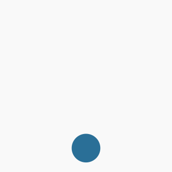

# 2.2 Screen Readers - Mobile

## What is a screen reader?

A screen reader is an assistive technology that reads aloud the text displayed on the screen, enabling users who are blind or have low vision to navigate and interact with websites through auditory feedback.

## Gestures Overview

You will use the following gestures in this section:

Swipe right

Swipe left

Swipe up

Swipe down

Swipe down + up

Swipe up + down

Swipe down + right

Swipe up + right

Twisting

## Exercises

Screen readers use specific gestures to navigate on mobile devices. Here are exercises to help you get familiar with these gestures:

### Exercise 1: Turning the Screen Reader On/Off

Familiarize yourself with turning the screen reader on and off.

iOS

1. Go to `Settings` -> `Accessibility` -> `Accessibility Shortcut` and select `VoiceOver`.

| OS      | Action         | Shortcut                                         |                                                                                                   |
| ------- | -------------- | ------------------------------------------------ | ------------------------------------------------------------------------------------------------- |
| Android | Turning on     | <kbd>Volume up + down</kbd> for 3s               | [Android docs](https://support.google.com/accessibility/android/answer/6007100)                   |
| Android | Turning off    | <kbd>Volume up + down</kbd> for 3s               | [Android docs](https://support.google.com/accessibility/android/answer/14252950)                  |
| Android | Pause speaking | <kbd>Tap the screen</kbd>                        |                                                                                                   |
| iOS     | Turning on     | <kbd>Home button</kbd> x 3 (after configuration) | [iOS docs](https://support.apple.com/guide/iphone/turn-on-and-practice-voiceover-iph3e2e415f/ios) |
| iOS     | Turning off    | <kbd>Home button</kbd> x 3 (after configuration) | [iOS docs](https://support.apple.com/guide/iphone/turn-on-and-practice-voiceover-iph3e2e415f/ios) |
| iOS     | Pause speaking | <kbd>Two-finger tap</kbd>                        |                                                                                                   |

### Exercise 2: Exploration by Touch

After activating the screen reader, you can explore the screen by touch. The screen reader will announce the elements you touch.

1. Turn the screen reader on.
2. Explore the screen by touching various elements.
3. To activate an element, double-tap anywhere on the screen.
4. Turn off the screen reader.

| OS      | Action                   | Shortcut          |
| ------- | ------------------------ | ----------------- |
| Android | Activate element (click) | <kbd>Tap</kbd> x2 |
| iOS     | Activate element (click) | <kbd>Tap</kbd> x2 |

### Exercise 3: Basic Navigation

Navigate through a website using simple gestures:

1. Go to [Salzburg Wikipedia](https://en.wikipedia.org/wiki/Salzburg).
2. Turn on the screen reader.
3. Navigate using <kbd>Swipe left</kbd> and <kbd>Swipe right</kbd>.
4. Turn off the screen reader.

| OS      | Action           | Shortcut               |
| ------- | ---------------- | ---------------------- |
| Android | Next element     | <kbd>Swipe right</kbd> |
| Android | Previous element | <kbd>Swipe left</kbd>  |
| iOS     | Next element     | <kbd>Swipe right</kbd> |
| iOS     | Previous element | <kbd>Swipe left</kbd>  |

### Exercise 4: Navigate by Elements

Navigating through every element on a webpage can be time-consuming. Screen reader users often navigate by headings to skip through sections.

1. Return to the Wikipedia page.
2. Turn on the screen reader.
3. Use the `Choose element type` gesture to select the type of element you want to navigate through (e.g., headers).
4. Navigate using <kbd>Swipe up</kbd> and <kbd>Swipe down</kbd>.
5. Turn off the screen reader.

| OS      | Action              | Shortcut                                                 |
| ------- | ------------------- | -------------------------------------------------------- |
| Android | Choose element type | <kbd>Swipe up + down</kbd> or <kbd>Swipe down + up</kbd> |
| Android | Next element        | <kbd>Swipe down</kbd>                                    |
| Android | Previous element    | <kbd>Swipe up</kbd>                                      |
| iOS     | Choose element type | <kbd>Twisting</kbd>                                      |
| iOS     | Next element        | <kbd>Swipe down</kbd>                                    |
| iOS     | Previous element    | <kbd>Swipe up</kbd>                                      |

### Exercise 5: Additional Features (Android)

Explore additional TalkBack features on Android:

1. Turn on the screen reader.
2. Open the TalkBack menu using <kbd>Swipe down + right</kbd> or <kbd>Swipe up + right</kbd>.
3. Explore the menu.
4. Turn off the screen reader.

| OS      | Action             | Shortcut                                                     |
| ------- | ------------------ | ------------------------------------------------------------ |
| Android | Open TalkBack menu | <kbd>Swipe down + right</kbd> or <kbd>Swipe up + right</kbd> |

### Exercise 6: Practice

1. Visit [Accessibility Wikipedia](https://en.wikipedia.org/wiki/Accessibility).
2. Turn on the screen reader.
3. Enable the screen curtain:
   - **Android**: Open TalkBack menu -> `Hide screen`. To disable it, select `Show screen`.
   - **iOS**: Triple-tap with three fingers.
4. Find information on "International standards and guidelines" under the section `Disability, information technology (IT) and telecommunications` > `Web accessibility`.
5. Click the link to the `Web Accessibility Initiative`.

## Resources

- [How to use TalkBack (Android) - A11y Casts from Google](https://www.youtube.com/watch?v=0Zpzl4EKCco&list=PLNYkxOF6rcICWx0C9LVWWVqvHlYJyqw7g&index=27)
- [How to use VoiceOver (iOS) - A11y Casts from Google](https://www.youtube.com/watch?v=bCHpdjvxBws&list=PLNYkxOF6rcICWx0C9LVWWVqvHlYJyqw7g&index=28)
- [Apple Support: Screen Curtain](https://support.apple.com/en-us/111797#:~:text=To%20turn%20Screen%20Curtain%20on%20or%20off%20by%20gesture%3A)
