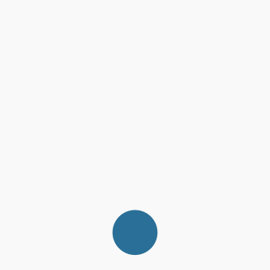

# 2.3. Screen readers

## How to use?

- TalkBack (Android) - https://www.youtube.com/watch?v=0Zpzl4EKCco&list=PLNYkxOF6rcICWx0C9LVWWVqvHlYJyqw7g&index=27
- VoiceOver (iOS) - https://www.youtube.com/watch?v=bCHpdjvxBws&list=PLNYkxOF6rcICWx0C9LVWWVqvHlYJyqw7g&index=28

## Gestures

In this section we will use the following gestures:

Swipe right

Swipe left

Swipe up

Swipe down

Swipe down + up

Swipe up + down

Swipe down + right

Swipe up + right

Twisting

## Exercises

On mobile devices to navigate using screen reader gestures are used. Here is the explanation of them:

### Exercise 1 - How to turn the screen reader on and off?

Turn the screen reader on and off, to get familiar with the process.

iOS

1. Before you can use accessibility shortcut on iOS you need to configure it.
2. Go to `Settings` -> `Accessibility` -> `Accessibility Shortcut` and choose `VoiceOver`.

| OS      | Action         | Shortcut                                         |                                                                                                   |
| ------- | -------------- | ------------------------------------------------ | ------------------------------------------------------------------------------------------------- |
| Android | Turning on     | <kbd>Volume up + down</kbd> for 3s               | [Android docs](https://support.google.com/accessibility/android/answer/6007100)                   |
| Android | Turning off    | <kbd>Volume up + down</kbd> for 3s               | [Android docs](https://support.google.com/accessibility/android/answer/14252950)                  |
| Android | Pause speaking | <kbd>Tap the screen</kbd>                        |                                                                                                   |
| iOS     | Turning on     | <kbd>Home button</kbd> x 3 (after configuration) | [iOS docs](https://support.apple.com/guide/iphone/turn-on-and-practice-voiceover-iph3e2e415f/ios) |
| iOS     | Turning off    | <kbd>Home button</kbd> x 3 (after configuration) | [iOS docs](https://support.apple.com/guide/iphone/turn-on-and-practice-voiceover-iph3e2e415f/ios) |
| iOS     | Pause speaking | <kbd>Two finger tap</kbd>                        |                                                                                                   |

### Exercise 2 - Exploration

After you turn on the screen reader you are in the `Explore by touch` mode. You can touch anything on the screen and the screen reader will announce it.

1. Turn the screen reader on
2. Explore the screen by touching different elements
3. If you want to click on (activate) an element, <kbd>double tap</kbd> somewhere on the screen
4. Turn off the screen reader

| OS      | Action                   | Shortcut          |
| ------- | ------------------------ | ----------------- |
| Android | Activate element (click) | <kbd>Tap</kbd> x2 |
| iOS     | Activate element (click) | <kbd>Tap</kbd> x2 |

### Exercise 3 - Basic navigation

1. Go to a wikipedia page, for example https://en.wikipedia.org/wiki/Salzburg.
2. Turn on the screen reader.
3. Move around the website using <kbd>Swipe left</kbd> or <kbd>Swipe right</kbd>.
4. Turn off the screen reader.

| OS      | Action           | Shortcut               |
| ------- | ---------------- | ---------------------- |
| Android | Next element     | <kbd>Swipe right</kbd> |
| Android | Previous element | <kbd>Swipe left</kbd>  |
| iOS     | Next element     | <kbd>Swipe right</kbd> |
| iOS     | Previous element | <kbd>Swipe left</kbd>  |

### Exercise 4 - Navigation by elements

The navigation through every element in the website is time consuming. Most of the screen reader users are navigating the page via headers.

1. Come back to the wikipedia page
2. Turn on the screen reader
3. Using `Choose element type` gesture choose element type you want to navigate through.
4. Navigate using <kbd>Swipe up</kbd> and <kbd>Swipe down</kbd> gestures.
5. Turn off the screen reader

| OS      | Action              | Shortcut                                                 |
| ------- | ------------------- | -------------------------------------------------------- |
| Android | Choose element type | <kbd>Swipe up + down</kbd> or <kbd>Swipe down + up</kbd> |
| Android | Next element        | <kbd>Swipe down</kbd>                                    |
| Android | Previous element    | <kbd>Swipe up</kbd>                                      |
| iOS     | Choose element type | <kbd>Twisting</kbd>                                      |
| iOS     | Next element        | <kbd>Swipe down</kbd>                                    |
| iOS     | Previous element    | <kbd>Swipe up</kbd>                                      |

### Exercise 5 - (Android) Additional features

1. Turn on the screen reader
2. Using <kbd>Swipe down + right</kbd> or <kbd>Swipe up + right</kbd> gesture open the TalkBack menu
3. Check different options in the menu, by tapping or swiping
4. Turn off the screen reader

| OS      | Action             | Shortcut                                                     |
| ------- | ------------------ | ------------------------------------------------------------ |
| Android | Open TalkBack menu | <kbd>Swipe down + right</kbd> or <kbd>Swipe up + right</kbd> |

### Exercise 6 - Practice

1. Go to https://en.wikipedia.org/wiki/Accessibility
2. Turn on the screen reader
3. Turn the curtain on
   - Android: Open TalkBack menu and choose `Hide screen` option. To hide the curtain open TalkBack menu and choose `Show screen`.
   - iOS: Triple <kbd>tap with three fingers</kbd>
4. Find information about `International standards and guidelines` (it is under `Disability, information technology (IT) and telecommunications` > `Web accessibility`)
5. Click the link leading to `Web Accessibility Initiative`

## Resources

- https://support.apple.com/en-us/111797#:~:text=To%20turn%20Screen%20Curtain%20on%20or%20off%20by%20gesture%3A

TODO: Add more resources
