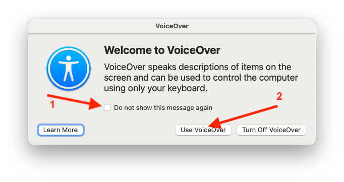

# 2.4. Screen Readers - Mac

## What is a screen reader?

A screen reader is assistive technology that reads aloud text displayed on a computer screen. It allows users with visual impairments to navigate and interact with websites using auditory feedback.

## Exercises

Keep this window open as a reference while you switch between exercises and instructions.

### Exercise 1 — Turning the screen reader on and off

> **Note**:
> The first time you enable VoiceOver, a dialog box appears. Check `Do not show this message again` and click `Use VoiceOver`.  
> 

Familiarize yourself with turning the screen reader on and off by pressing <kbd>⌘ + F5</kbd>. Note that the screen reader will start reading the content on the screen immediately.

| OS  | Action                 | Shortcut          |
| --- | ---------------------- | ----------------- |
| Mac | Turn screen reader on  | <kbd>⌘ + F5</kbd> |
| Mac | Turn screen reader off | <kbd>⌘ + F5</kbd> |

### Exercise 2 — Basic navigation

1. Go to [Salzburg Wikipedia](https://en.wikipedia.org/wiki/Salzburg).
2. Turn on the screen reader (<kbd>⌘ + F5</kbd>).
3. Follow the instructions to enter web content (<kbd>Ctrl + Option + Shift + Down Arrow</kbd>).
4. Navigate the website using <kbd>Ctrl + Option + Right/Left Arrow</kbd>.
5. Change the language of the website to German.
6. Turn off the screen reader (<kbd>⌘ + F5</kbd>).

> 💡 Hint: You can use <kbd>Ctrl + Option + ;</kbd> to lock the voice-over shortcut. This way, you don’t have to press <kbd>Ctrl + Option</kbd> every time. In many shortcuts, <kbd>Ctrl + Option</kbd> is written as `VO`.

| OS  | Action                | Shortcut                                      |
| --- | --------------------- | --------------------------------------------- |
| Mac | Enter content/element | <kbd>Ctrl + Option + Shift + Down Arrow</kbd> |
| Mac | Go up a level         | <kbd>Ctrl + Option + Shift + Up Arrow</kbd>   |
| Mac | Navigate              | <kbd>Ctrl + Option + Right/Left Arrow</kbd>   |

### Exercise 3 — Navigating by headings

Screen reader users often navigate by headings to quickly move through sections.

1. Go to [Salzburg Wikipedia](https://en.wikipedia.org/wiki/Salzburg).
2. Turn on the screen reader (<kbd>⌘ + F5</kbd>).
3. Enter web content (<kbd>Ctrl + Option + Shift + Down Arrow</kbd>).
4. Navigate between headings using <kbd>Ctrl + Option + Cmd + H</kbd> for next and <kbd>Ctrl + Option + Cmd + Shift + H</kbd> for previous.
5. Find out when Salzburg became independent from Bavaria.
6. Turn off the screen reader (<kbd>⌘ + F5</kbd>).

| OS  | Action           | Shortcut                                   |
| --- | ---------------- | ------------------------------------------ |
| Mac | Next heading     | <kbd>Ctrl + Option + Cmd + H</kbd>         |
| Mac | Previous heading | <kbd>Ctrl + Option + Cmd + Shift + H</kbd> |

### Exercise 4 — Navigating by other elements

You can also navigate by links, tables, forms, and graphics.

1. Return to the Wikipedia page.
2. Use the following shortcuts (<kbd>Ctrl + Option + Cmd + [Key]</kbd>) to move between elements. To go back to the previous element, add <kbd>Shift</kbd>.

| OS  | Element    | Shortcut     |
| --- | ---------- | ------------ |
| Mac | Link       | <kbd>L</kbd> |
| Mac | Table      | <kbd>T</kbd> |
| Mac | Form field | <kbd>J</kbd> |
| Mac | Graphic    | <kbd>G</kbd> |

### Exercise 5 — Using the Rotor

The rotor lets you quickly browse lists of elements like links, headings, or tables.

1. Turn on the screen reader (<kbd>⌘ + F5</kbd>).
2. Open the rotor using <kbd>Ctrl + Option + U</kbd>.
3. Use <kbd>Left/Right Arrow</kbd> to switch element types (headings, links, etc.).
4. Move through the list using the <kbd>Up/Down Arrow</kbd>.
5. Press <kbd>Enter</kbd> to select an element.

| OS  | Action             | Shortcut                     |
| --- | ------------------ | ---------------------------- |
| Mac | Open rotor         | <kbd>Ctrl + Option + U</kbd> |
| Mac | Change rotor type  | <kbd>Left/Right Arrow</kbd>  |
| Mac | Move in rotor list | <kbd>Up/Down Arrow</kbd>     |

### Exercise 6 — Automatic reading

Screen readers can automatically read content from the current position without manual navigation.

1. Go to [Salzburg Wikipedia](https://en.wikipedia.org/wiki/Salzburg).
2. Turn on the screen reader (<kbd>⌘ + F5</kbd>).
3. Navigate to the `History` heading.
4. Press <kbd>Ctrl + Option + A</kbd> to start reading.
5. Press <kbd>Ctrl</kbd> to pause.

| OS  | Action               | Shortcut                     |
| --- | -------------------- | ---------------------------- |
| Mac | Start auto reading   | <kbd>Ctrl + Option + A</kbd> |
| Mac | Pause/Resume reading | <kbd>Ctrl</kbd>              |

### Exercise 7 — Screen reader settings

1. Turn on the screen reader.
2. Use the shortcuts below to adjust settings like `Rate`, `Pitch`, and `Voice`.
3. Experiment with different settings to find what works best for you.
4. Turn off the screen reader.

| OS  | Action                | Shortcut                                                  |
| --- | --------------------- | --------------------------------------------------------- |
| Mac | Open settings         | <kbd>Ctrl + Option + Cmd + Shift + any arrow</kbd>        |
| Mac | Change setting type   | <kbd>Ctrl + Option + Cmd + Shift + Left/Right Arrow</kbd> |
| Mac | Move in settings list | <kbd>Ctrl + Option + Cmd + Shift + Up/Down Arrow</kbd>    |

### Exercise 8 — Practice

Now, use the screen reader to locate specific information on a practice website.

1. Open [./assets/Wikipedia.html](./assets/Wikipedia.html) or http://ubax.github.io/a11y-kata/2-tools/assets/Wikipedia.html.
2. Turn on the screen reader.
3. Use it to find out which parks are located in Cracow's city center.
4. Open the link to a Wikipedia article about one of these parks.

## Resources

- [How to use VoiceOver (Mac) - A11y Casts from Google](https://www.youtube.com/watch?v=5R-6WvAihms&list=PLNYkxOF6rcICWx0C9LVWWVqvHlYJyqw7g&index=7)
- [Screen Curtain](https://support.apple.com/en-us/111797#:~:text=With%20VoiceOver%20turned%20on%2C%20use%20this%20key%20command%20to%20enable%20Screen%20Curtain%3A)
- [Using trackpad gestures with VoiceOver](https://support.apple.com/guide/voiceover/use-trackpad-gestures-to-control-voiceover-vo28030/mac)
