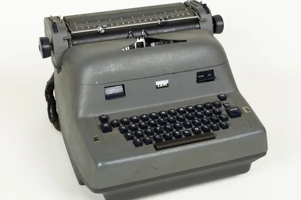

# 4.1. Alternative Text

In this exercise, your task is to enhance the accessibility of the images on the page _before.html_.

- [https://ubax.github.io/.../before.html](https://ubax.github.io/a11y-kata/4-pitfalls/4.01-alternative_text/before.html)
- [https://localhost:8000/.../before.html](http://localhost:8000/4-pitfalls/4.01-alternative_text/before.html)
- [source code](./before.html)

Additionally, you can refer to the [after.html](after.html) file to compare your solutions.

TODO: Add step by step instructions

## Hints

<details>
<summary>Hint 1</summary>

- Check the images on the website with screen reader

</details>

<details>
<summary>Hint 2</summary>

- Check when the images description is redundant or too long

</details>

## Problems & solutions

<details>
<summary>Problem 1</summary>

The first issue is that important images in the article are missing alternative text.

</details>
<details>
<summary>Solution for problem 1</summary>
To resolve this, add alternative text to the significant images in the content. For example:

```html
...

...

...<b>test</b>

...
```

</details>

<details>
<summary>Problem 2</summary>

The images in the `Buy Your Next Keyboard` section do not require alternative text. They can be considered as [decorative images](https://www.w3.org/WAI/tutorials/images/decorative/), because they illustrate the products mentioned in the adjacent headers.

</details>
<details>
<summary>Solution for problem 2</summary>
For decorative images, use `alt=""` so that screen readers will ignore them. For example:

```html
...

...

...

...
```

</details>

<details>
<summary>Problem 3</summary>

The alternative text for the typewriter image is too long, which may overwhelm users of screen readers.

</details>
<details>
<summary>Solution for problem 3</summary>
Provide a more concise alternative text for the image. For instance:

```html
...

...
```

</details>

## Resources

- [WCAG 2.1 - Success Criteria 1.1.1](https://www.w3.org/WAI/WCAG21/Understanding/non-text-content.html)
- [W3 tutorial on accessible images](https://www.w3.org/WAI/tutorials/images/)
- [Decorative images](https://www.w3.org/WAI/tutorials/images/decorative/)
- [alt property documentation](https://developer.mozilla.org/en-US/docs/Web/API/HTMLImageElement/alt)

## Image sources

- [Unsplash](https://unsplash.com/)
- [Electric Typewriter Image](<https://commons.wikimedia.org/wiki/File:IBM_Model_A_typewriter_(1).webp/>)
